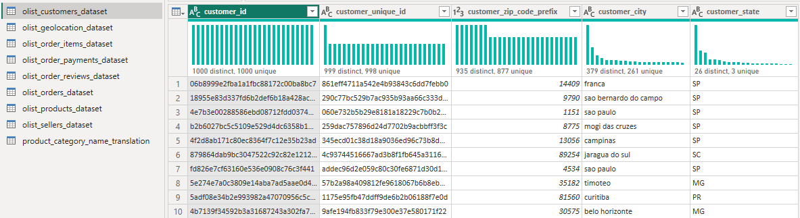
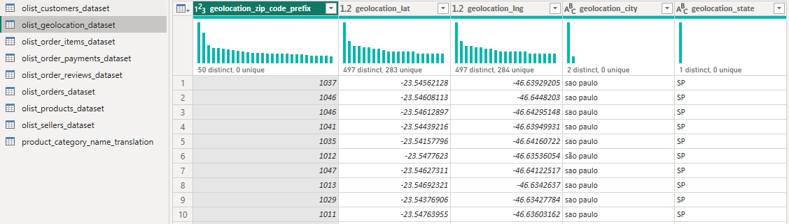
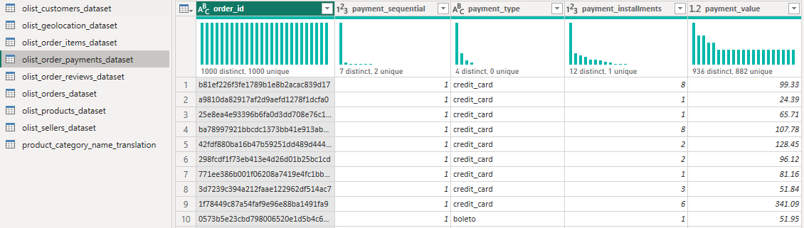
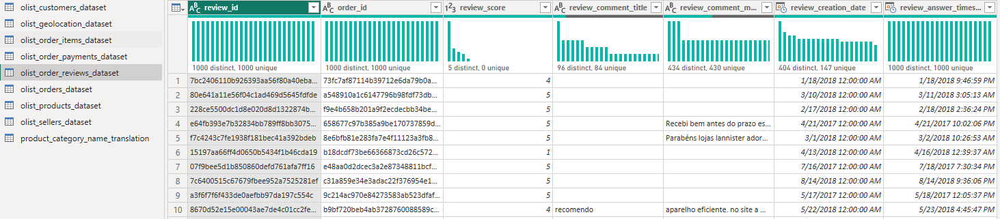
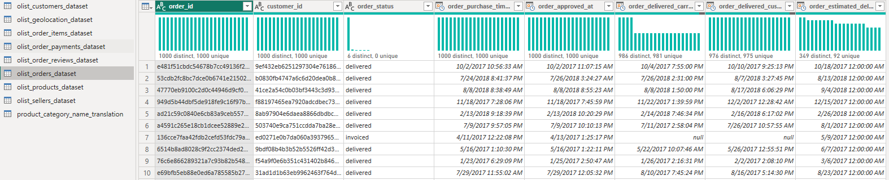
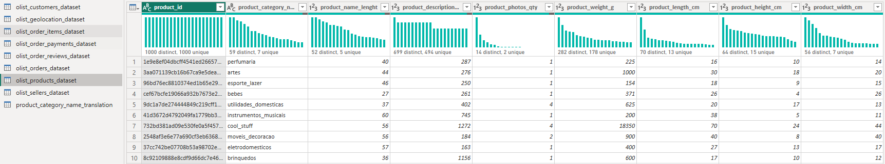
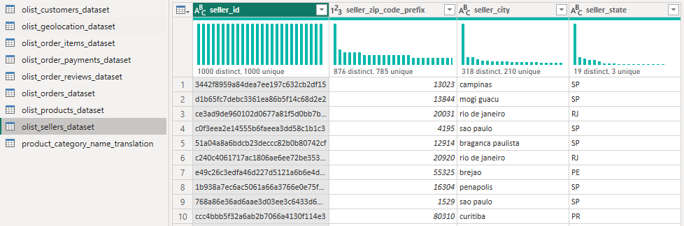
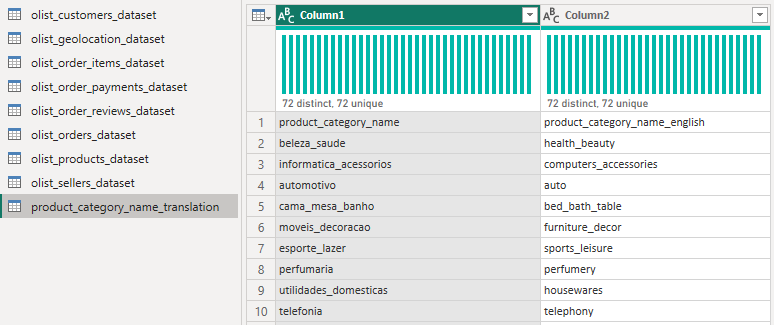

# [Brazilian E-commerce Dataset by Olist](https://www.kaggle.com/datasets/olistbr/brazilian-ecommerce)

This dataset originates from a Brazilian e-commerce platform which is curated and published by Olist. It encompasses data pertaining to 100,000 orders spanning from 2016 to 2018. These orders were placed across various geographic marketplaces in Brazil. The dataset is rich in information, offering insights into orders from multiple facets including order status, pricing details, payment and shipping performance, as well as customer location, product characteristics, and even customer-written reviews. To enhance the dataset, a separate geolocation dataset has been made available, connecting Brazilian postal codes with corresponding latitude and longitude coordinates.

It's important to note that this dataset consists of actual commercial data, though it has been anonymized. Additionally, any mentions of companies and partners within customer reviews have been substituted with the names of prominent houses from the Game of Thrones universe.

## Database tables:
- olist_customers_dataset
- olist_geolocation_dataset
- olist_order_items_dataset
- olist_order_payment_dataset
- olist_order_reviews_dataset
- olist_orders_dataset
- olist_products_dataset
- olist_sellers_dataset
- olist_product_category_name_translation

Before constructing a data model based on these tables, it's essential to distinguish between fact and dimension tables. Fact tables inherently lack an entirely unique field across the table, while dimension tables necessitate a unique field. This differentiation can be conveniently visualized through tools like Power BI.

To achieve this, navigate to the model view and access the "Transform data" section. Within this section, proceed to the "View" option and select "Column distribution." This will display the distribution of entries within all fields of an individual table. Following the steps, we discovered the subsequent distributions:
### olist_customers_dataset:

### olist_geolocation_dataset:

### olist_order_items_dataset:

### olist_order_payment_dataset: 

### olist_order_reviews_dataset:

### olist_orders_dataset:

### olist_products_dataset:

### olist_sellers_dataset:

### olist_product_category_name_translation:

Based on the observation we have determined the dimension tables and fact table as follows:
| Dataset Name                                | Table Type                     |
|---------------------------------------------|--------------------------------|
| olist_customers_dataset                     | Dimension Table                |
| olist_geolocation_dataset                   | Dimension Table                |
| olist_order_items_dataset                   | Fact Table                     |
| olist_order_payment_dataset                 | Dimension Table                |
| olist_order_reviews_dataset                 | Dimension Table                |
| olist_orders_dataset                        | Dimension Table                |
| olist_products_dataset                      | Dimension Table                |
| olist_sellers_dataset                       | Dimension Table                |
| olist_product_category_name_translation     | Dimension Table                |

The table labeled "olist_product_category_name_translation" presents a unique challenge due to its absence of proper column headers, instead employing the names "Column1" and "Column2." Interestingly, upon closer inspection, it becomes evident that the first-row values in this table correspond to the intended column headers. We need to fix this issue before proceeding further. Overcoming this issue is remarkably straightforward within Power BI. By navigating to the "Home" tab of this table, a button aptly named "Use First Row as Header" becomes available. Upon clicking this button, a transformative change unfolds.

