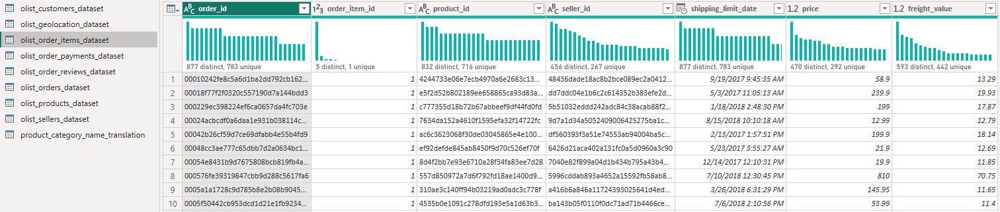

# [Brazilian E-commerce Dataset by Olist](https://www.kaggle.com/datasets/olistbr/brazilian-ecommerce)

This dataset originates from a Brazilian e-commerce platform which is curated and published by Olist. It encompasses data pertaining to 100,000 orders spanning from 2016 to 2018. These orders were placed across various geographic marketplaces in Brazil. The dataset is rich in information, offering insights into orders from multiple facets including order status, pricing details, payment and shipping performance, as well as customer location, product characteristics, and even customer-written reviews. To enhance the dataset, a separate geolocation dataset has been made available, connecting Brazilian postal codes with corresponding latitude and longitude coordinates.

It's important to note that this dataset consists of actual commercial data, though it has been anonymized. Additionally, any mentions of companies and partners within customer reviews have been substituted with the names of prominent houses from the Game of Thrones universe.

## Database tables:
- olist_customers_dataset
- olist_geolocation_dataset
- olist_order_items_dataset
- olist_order_payment_dataset
- olist_order_reviews_dataset
- olist_orders_dataset
- olist_products_dataset
- olist_sellers_dataset
- olist_product_category_name_translation

Before constructing a data model based on these tables, it's essential to distinguish between fact and dimension tables. Fact tables inherently lack an entirely unique field across the table, while dimension tables necessitate a unique field. This differentiation can be conveniently visualized through tools like Power BI.

To achieve this, navigate to the model view and access the "Transform data" section. Within this section, proceed to the "View" option and select "Column distribution." This will display the distribution of entries within all fields of an individual table. Following the steps, we discovered the subsequent distributions:
### olist_customers_dataset:

### olist_geolocation_dataset:

### olist_order_items_dataset:

### olist_order_payment_dataset: 

### olist_order_reviews_dataset:

### olist_orders_dataset:

### olist_products_dataset:

### olist_sellers_dataset:

### olist_product_category_name_translation:

## Database modeling:

Based on the observation we have determined the dimension tables and fact table as follows:
| Dataset Name                                | Table Type                     |
|---------------------------------------------|--------------------------------|
| olist_customers_dataset                     | Dimension Table                |
| olist_geolocation_dataset                   | Dimension Table                |
| olist_order_items_dataset                   | Fact Table                     |
| olist_order_payment_dataset                 | Dimension Table                |
| olist_order_reviews_dataset                 | Dimension Table                |
| olist_orders_dataset                        | Dimension Table                |
| olist_products_dataset                      | Dimension Table                |
| olist_sellers_dataset                       | Dimension Table                |
| olist_product_category_name_translation     | Dimension Table                |

The table labeled "olist_product_category_name_translation" presents a unique challenge due to its absence of proper column headers, instead employing the names "Column1" and "Column2." Interestingly, upon closer inspection, it becomes evident that the first-row values in this table correspond to the intended column headers. We need to fix this issue before proceeding further. Overcoming this issue is remarkably straightforward within Power BI. By navigating to the "Home" tab of this table, a button aptly named "Use First Row as Header" becomes available. Upon clicking this button, a transformative change unfolds.

Subsequently, the headers are successfully modified, enabling us to initiate the process of data modeling. From this point, meaningful insights can be derived by visualizing and analyzing the data with clarity and precision. With the datasets now being cleaned, corrected, and the dimension tables and fact tables being identified, we are ready to commence the data modeling phase. The available options for modeling:

- **Star schema**
- **Snowflake schema**
- **Galaxy schema**

We have chosen the snowflake schema for this dataset due to the fact that all the tables cannot be connected to a single fact table. For instance, product_category_name_translation table has no direct connection with the fact table olist_orders_dataset. Instead, it can be connected to another dimension table olist_products_dataset based on the product_category_name field. As of now, we have the following tables ready for data modeling:

It's important to note that there are currently no established connections among the tables within this dataset. To enable seamless querying across the entire dataset, it is imperative to establish relationships among the tables. This can be achieved through three distinct approaches:
1.	**Automatic Detection via Power BI:** Utilizing the capabilities of Power BI, the software can autonomously detect and establish relationships between tables.
2.	**Manage Relationships Option (Model View):** This approach involves accessing the Model View and utilizing the "Manage Relationships" feature to manually define and manage relationships between tables.
3.	**Drag and Drop of Primary Keys:** An alternative manual method involves directly dragging and dropping primary key attributes from one table to another, thereby defining relationships.

Using the available options, we can come up with the following relationship within the tables:

Here the asterisk (*) symbol means and so we have 7 one-to-many relationships and 1 many-to-many relationship. The direction of the line between two tables means how data is filtered in visualizations and queries. Note that the fact table only holds foreign keys, and the dimension tables contain the primary keys. Now, our data model is complete and ready to be queried or visualized using Power BI.

## Data Visualization:
We employed the Power BI software to create visualizations for five key performance indicators (KPIs) of the E-commerce business. Additionally, we included other important measurable metrics that stakeholders require in order to make well-informed decisions.

[Click here to view in Power BI](https://app.powerbi.com/reportEmbed?reportId=40bfc821-b31a-4581-aac2-4ca8ebdf56c6&autoAuth=true&ctid=990436a6-87df-491c-9124-9afa91f88827)

<iframe title="Brazilian E-commerce Dataset by Olist" width="1140" height="541.25" src="https://app.powerbi.com/reportEmbed?reportId=40bfc821-b31a-4581-aac2-4ca8ebdf56c6&autoAuth=true&ctid=990436a6-87df-491c-9124-9afa91f88827" frameborder="0" allowFullScreen="true"></iframe>
